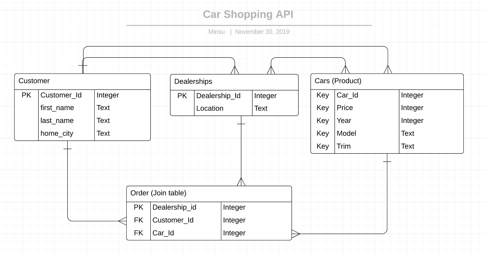

# Car Shopping API

#### This API allows you to get the acquire information on the top car dealerships in Bay Area as well as each customer information and their purchase order. 

## Entity Relationship Diagram 

## GET customers request 
#### /api/customers
#### /api/customers/:id
|   Name      | Path        | Description |
| ----------- | ----------- | ----------- |
|  All Customers Search  | /api/customers | Get information of every customer |
|  Single Customer Search | /api/customers/:id | Get a single customer's inforation  |

## GET dealerships request 
#### /api/dealerships
#### /api/dealership
##### Type city location in body 
|   Name      | Path        | Description |
| ----------- | ----------- | ----------- |
|  All Dealerships Search  | /api/dealerships | Get all dealership location |
|  One Dealership Search | /api/dealership | Get a single dealership's location by typing city on body |

## GET cars request 
#### /api/cars/
#### /api/cars/:id

|    Name     |    Path     | Description  |
| ----------- | ----------- | ----------- |
| All Cars Search      | /api/cars       |  Get list of all car information   |
| One Car Search      | /api/cars/:id       |  Get information on specific car|
